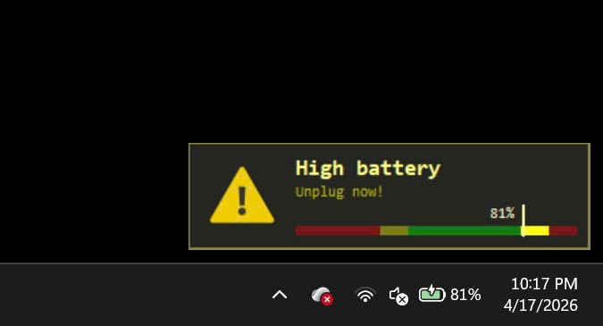

# 🔋 Battery Tracker


> Lightweight background app to monitor battery percentage and help extend Li-ion battery lifespan.

---

## ✨ Features

* 🔔 **Smart battery alerts**

  * Notify when battery drops below **40%**
  * Notify when battery exceeds **80%**

* 🪟 **Dual notification system**

  * Native Windows notification
  * Custom popup at bottom-right corner

* ⚡ **Lightweight & silent**

  * Runs in background
  * No taskbar icon
  * Minimal resource usage

* 🚀 **Auto start with Windows**

---

## 📸 Preview

> Popup notification example:



---

## 📦 Installation

1. Go to **Releases**
2. Download latest `.exe`
3. Run installer
4. Done — app will run automatically

---

## 🚀 Usage

* No configuration needed
* App runs silently in background
* Automatically monitors battery status

---

## 🛠️ Build from source

### Requirements

* MSYS2 (UCRT64)
* CMake
* C++17 compatible compiler

### Build steps

```bash
git clone https://github.com/yourname/battery-tracker.git
cd battery-tracker
build.bat
```

---

## 📁 Project Structure

```
battery-tracker/
├── src/
├── include/
├── CMakeLists.txt
├── build.bat
├── installer/
│   └── setup.iss
└── assets/
    └── popup.png
```

---

## 📌 Notes

* Designed specifically for **Li-ion battery health optimization**
* Recommended usage range: **40% – 80%**

---

## 📜 License

This project is released under the **Unlicense** — free to use, modify, and distribute without restriction.

---

## ⭐ Support

If you find this project useful, consider giving it a star on GitHub ⭐
